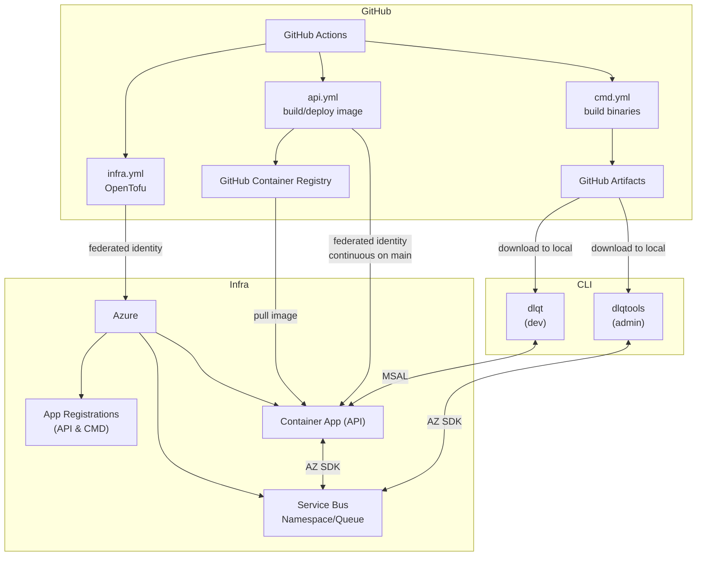

# dlqt
 
CLI tool suite for interacting with Azure Service Bus DLQ 
 
## Usage
 
### `dlqt`
 
- Developer oriented, for retriggering DLQ messages
- uses `az login` for reading (requires Service Bus Data Reader role) and [api](#api) for retriggering
- run `dlqt -h` for usage info

### `dlqtools`

- Admin oriented, for managing/testing DLQ messages
- uses `az login` for auth (requires Service Bus Data Owner role)
- run `dlqtools -h` for usage info

### `api`

- HTTP API service for authenticated DLQ message retriggering
- runs in Azure Container Apps with managed identity
- authenticates users via MSAL tokens
- provides fine-grained access control for message retriggering
 
## Architecture
 
The system consists of:
1. `dlqt` - Developer CLI tool for secure message retriggering
2. `dlqtools` - Admin CLI tool with direct Service Bus access
3. `api` - Containerized API service for secure message retriggering
4. Azure Service Bus with RBAC for the API service
 


**Developer Workflow:**
- Developers use `dlqt retrigger` which calls the `api` API with their Azure AD token
- The API service validates the token and performs the retrigger operation using its managed identity
- Developers cannot modify message contents, only retrigger
 
**Admin Workflow:**
- Admins use `dlqtools` with direct Service Bus access for full queue management
- Includes seed, purge, and other admin operations

## Build
 
### `dlqt`
 
- local
  ```bash
  go install ./cmd/dlqt && source <(dlqt completion zsh)
  which dlqt
  dlqt -h
  ```
- shipped (see GitHub)

### `dlqtools`

- local
  ```bash
  go install ./cmd/dlqtools && source <(dlqtools completion zsh)
  which dlqtools
  dlqtools -h
  ```
- shipped (see GitHub)

### `api`

- local 
  ```bash
  cd api
  docker build -t dlqt/api .
  ```
- shipped (see GitHub)

## Deployment

1. Deploy infrastructure:
```bash
cd infra
tofu init
tofu plan
tofu apply
```

2. Build and push the API service container:
```bash
cd api
docker build -t dlqt/api .
docker tag dlqt/api <your-registry>/dlqt/api:latest
docker push <your-registry>/dlqt/api:latest
```

3. Update the container app image in Terraform and redeploy

## To Do
 
### `dlqt`
 
- [ ] API, used Azure AD groups and something idk?
- [ ] add more developer-friendly features

### `dlqtools`

- [x] DLQ purge command
